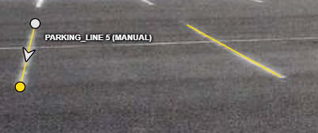
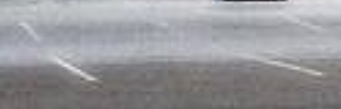
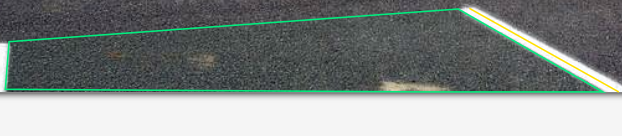
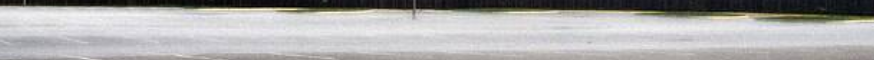

# Quan sát vạch ô đỗ

- Hai vạch `parking_line` đã vẽ (mô tả vị trí trong ảnh): 
- Một vạch/dấu sơn hoặc biên **không** vẽ, và vì sao: 
    Không, vì không nhìn thấy rõ nên không 
- Polygon `free_space` dừng ở đâu; có phần bị che nào không: 
- Ca chưa chắc cần hỏi người soát (nếu không có, ghi “không có”): 
    Chỗ này có tính là free space ko
